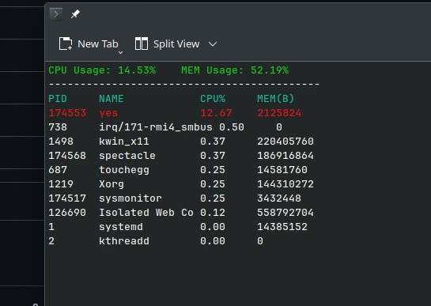

# unixSystemMonitor


A lightweight, terminal-based system monitor for Linux environments written entirely in C. Developed as part of the Unix Workshop PBL at JIIT, this project interfaces directly with the Linux kernel to track and display system resource utilization in real-time.

## System Architecture and Data Acquisition

Unlike standard utilities that rely on user-space abstraction layers, this monitor directly parses kernel data structures via the `/proc` pseudo-filesystem. The program extracts system states continuously from the following targets:

* `/proc/stat`: Global CPU time states (user, nice, system, idle, iowait, irq, softirq).
* `/proc/meminfo`: Global physical memory allocation and availability.
* `/proc/[PID]/stat`: Process-specific CPU scheduling parameters (`utime`, `stime`).
* `/proc/[PID]/statm`: Process-specific memory allocation, specifically Resident Set Size (`rss`).

## Resource Calculation Methodology

System metrics are calculated dynamically over a one-second sampling interval. The program records initial state vectors, suspends execution, records secondary state vectors, and computes the rate of change (deltas).

### CPU Utilization
For individual process CPU utilization, the user and system times are aggregated:

$$
\Delta t_{\text{process}} = (\text{utime} + \text{stime})_{t_2} - (\text{utime} + \text{stime})_{t_1}
$$

The global CPU time elapsed across all cores ($\Delta t_{\text{total}}$) is calculated by summing all states in `/proc/stat`. The relative utilization is computed as:

$$
\text{CPU Ratio} = \left( \frac{\Delta t_{\text{process}}}{\Delta t_{\text{total}}} \right) \times 100
$$

For the global system load, the idle state delta ($\Delta t_{\text{idle}}$) is isolated from the total system delta:

$$
\text{Total CPU Load} = \left( \frac{\Delta t_{\text{total}} - \Delta t_{\text{idle}}}{\Delta t_{\text{total}}} \right) \times 100
$$

### Memory Allocation
The physical memory footprint of a process is determined by reading its Resident Set Size (`rss`), which is measured in memory pages. This is converted to absolute bytes using the underlying architecture's page size constraint:

$$
\text{Memory (Bytes)} = \text{rss} \times \text{getpagesize()}
$$

## Core Implementation

The codebase is modularized to separate kernel I/O, data processing, and rendering logic:

* `main.c`: Orchestrates the main execution loop, interval timing, and delta calculations.
* `proc.c`: Handles file descriptor operations and text parsing from the `/proc` directory, populating `Process` structs.
* `sort.c`: Implements the `qsort` comparators required to rank processes by resource consumption.
* `ui.c`: Manages the `ncurses` display layer, rendering the process table and applying conditional formatting (highlighting processes exceeding 10% CPU utilization).

## Build and Execution

### Dependencies
The project requires the standard GCC toolchain and the `ncurses` development library. 

On Debian/Ubuntu-based systems:
```bash
sudo apt-get update
sudo apt-get install libncurses5-dev libncursesw5-dev
```

On Arch Linux:
```bash
sudo pacman -S ncurses
```

### Compilation
Clone the repository and build the executable using the provided `Makefile`:

```bash
git clone [https://github.com/yourusername/unixSystemMonitor.git](https://github.com/yourusername/unixSystemMonitor.git)
cd unixSystemMonitor
make all
```

### Usage
Execute the binary to launch the interface. The monitor will run continuously, updating every second, until terminated via `SIGINT` (`Ctrl+C`).

```bash
./sysmonitor
```

## Example Output

| System Monitor Interface |
| :---: |
|  |

## Limitations and Future Scope

While the current iteration successfully provides a lightweight dashboard, the following limitations present opportunities for future development:

* **Fixed Sorting Metric:** The current `qsort` implementation ranks processes strictly by CPU usage. Future iterations will include dynamic sorting criteria, allowing users to toggle between memory (`rss`) and CPU ranking to identify memory leaks.
* **Static Refresh Rate:** The monitor utilizes a fixed `sleep(1)` interval. This macro-level sampling may miss micro-bursts of processor activity that execute in fractional seconds.
* **Process Management:** The dashboard is currently view-only. Future scope includes implementing the `kill()` system call and interactive ncurses listeners to allow users to securely terminate unresponsive processes directly from the UI.

---
**Authors:** Ayush Raj Gaur, Harshil Kumar, Aayush Singh, Kritika Naagar, Suraz Kumar Shah  
**Institution:** Jaypee Institute of Information Technology (JIIT)  
**Course:** Unix Workshop (23B58CS125)

*Documentation formatting and LaTeX structuring assisted by Google Gemini.*
